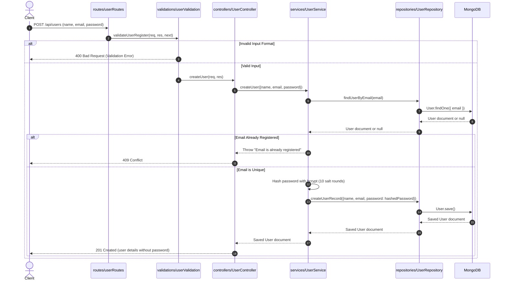

# Inventory Management Server - User Registration Flow

This directory contains the Express & TypeScript backend server for the Inventory Management system. It implements a clean, modular **functional Repository-Service-Controller (RSC)** design pattern.

---

## Folder & File Structure

Here is the location and role of each file participating in the User creation flow:

```text
src/
├── app.ts                         # Sets up global Express middlewares and mounts API routers
├── server.ts                      # Starts the HTTP server and database connection
├── models/
│   └── User.ts                    # Mongoose database schema and TypeScript interface for Users
├── validations/
│   └── userValidation.ts          # Middleware validating incoming request bodies
├── routes/
│   └── userRoutes.ts              # Express router mapping POST / to the controller function
├── controllers/
│   └── UserController.ts          # Express handler parsing requests and sending HTTP responses
├── services/
│   └── UserService.ts             # Core business logic (hashing password, checking uniqueness)
└── repositories/
    └── UserRepository.ts          # Direct database interaction queries (encapsulating Mongoose)
```

---

## User Creation Execution Flow

The diagram below details the sequence of events that occurs when a new user registers:



---

## Detailed Step-by-Step Flow Explanation

### Phase 1: The Starting Point (Booting the Server)
When you run `npm run dev`, the server bootstraps as follows:

1. **[server.ts](file:///Users/prakashpaudel/Desktop/INVENTORY-MANAGEMENT/server/src/server.ts) (The Igniter)**:
   * Loads configurations and variables from `.env`.
   * Calls `connectDB()` to verify the database connection to MongoDB.
   * Imports the Express `app` instance from `app.ts` and spins it up: `app.listen(PORT)`.
2. **[app.ts](file:///Users/prakashpaudel/Desktop/INVENTORY-MANAGEMENT/server/src/app.ts) (The Gatekeeper)**:
   * Sets up global Middlewares (CORS, parses incoming JSON payloads, handles cookies, loggers, security headers).
   * Maps path directories. For instance, any incoming URL matching `/api/users` is delegated to `userRoutes.ts`.

---

### Phase 2: The Journey of a Request (Creating a User)
When a registration payload is sent (e.g. `POST /api/users`):

1. **The Route Selector ([userRoutes.ts](file:///Users/prakashpaudel/Desktop/INVENTORY-MANAGEMENT/server/src/routes/userRoutes.ts))**:
   * Catches the `POST /` request and executes functions sequentially: first the validator middleware, then the controller handler.
2. **The Input Validation Guard ([userValidation.ts](file:///Users/prakashpaudel/Desktop/INVENTORY-MANAGEMENT/server/src/validations/userValidation.ts))**:
   * Inspects the payload (`name`, `email`, `password`) to confirm constraints.
   * If validation fails, it halts the execution chain immediately and returns a `400 Bad Request`.
   * If validation succeeds, it triggers `next()` to proceed to the controller.
3. **The Controller / HTTP Translator ([UserController.ts](file:///Users/prakashpaudel/Desktop/INVENTORY-MANAGEMENT/server/src/controllers/UserController.ts))**:
   * Maps the HTTP payload from `req.body` and calls the `createUser` business logic service function.
4. **The Service / Business Logic ([UserService.ts](file:///Users/prakashpaudel/Desktop/INVENTORY-MANAGEMENT/server/src/services/UserService.ts))**:
   * Runs the core rules: checks if the email is already in the database by calling the repository. If it exists, throws an error.
   * Hashes the plain-text password using `bcrypt` (10 salt rounds) for database security.
   * Calls `createUserRecord` on the repository layer.
5. **The Repository / Database Layer ([UserRepository.ts](file:///Users/prakashpaudel/Desktop/INVENTORY-MANAGEMENT/server/src/repositories/UserRepository.ts))**:
   * Interacts with MongoDB using the Mongoose model to save the new user.
   * Once saved, it returns the database document back up the chain.
6. **Sending the Response**:
   * The saved record goes from Repository $\rightarrow$ Service $\rightarrow$ Controller.
   * The Controller filters out password details and returns a secure `201 Created` JSON payload to the user.

---

## API Documentation

### Register User

* **URL**: `/api/users`
* **Method**: `POST`
* **Headers**: 
  * `Content-Type: application/json`

**Sample Request Body:**
```json
{
  "name": "Jane Doe",
  "email": "jane.doe@example.com",
  "password": "securepassword123"
}
```

#### Responses:

* **`201 Created`**: Registration successful.
  ```json
  {
    "message": "User created successfully",
    "user": {
      "id": "64bcde65287f34ac2b0123ef",
      "name": "Jane Doe",
      "email": "jane.doe@example.com",
      "createdAt": "2026-07-19T09:40:00.000Z"
    }
  }
  ```

* **`400 Bad Request`**: Validation failed (e.g. password too short, malformed email).
  ```json
  {
    "error": "Password must be at least 6 characters long"
  }
  ```

* **`409 Conflict`**: The email is already registered.
  ```json
  {
    "error": "Email is already registered"
  }
  ```
